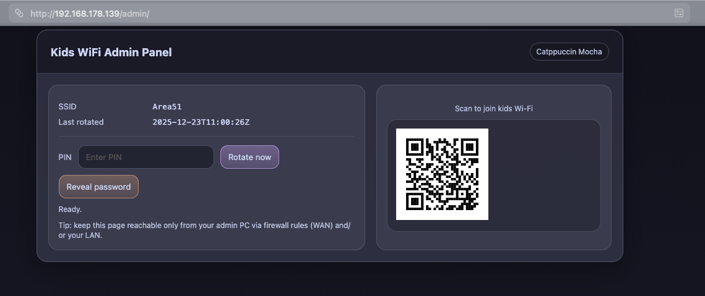

# OPENWRT-KIDSNETWORK



A small, practical OpenWrt setup for **kids Wi‑Fi access control**:

- Separate **Kids network** (own bridge + subnet + DHCP)
- Kids SSID isolated from your main LAN (and optional client isolation)
- **On‑demand Wi‑Fi password rotation** with **QR code (SVG)**
- A minimal **Admin Panel** served by the router (Catppuccin Mocha theme)
- Safe(ish) remote management from an upstream router network (e.g. Fritz!Box `192.168.178.0/24`) via **tight WAN firewall rules**

> This project is designed for home use. Do **not** expose the admin panel to the public internet.

---

## Target hardware

Tested flow: GL.iNet GL‑MT3000 (Beryl AX) flashed to **vanilla OpenWrt**.

It should work on most OpenWrt devices with:
- LuCI/uhttpd
- `qrencode`
- a standard `wan` firewall zone

---

## Network model

**Upstream router:** Fritz!Box on default LAN `192.168.178.0/24`

**OpenWrt device:**
- `wan` = DHCP client on Fritz LAN (gets a `192.168.178.x` address)
- `lan` = your internal network (default OpenWrt LAN is usually `192.168.1.1/24`)
- `kids` = isolated Wi‑Fi only network (recommended subnet `192.168.23.0/24`)

Kids devices:
- Can reach the internet (NAT out `wan`)
- Cannot reach the OpenWrt router services (except DHCP/DNS)
- Cannot reach your main LAN

---

## What you’ll install (final product)

### Files

- `/www/admin/index.html` – Admin panel UI
- `/www/admin/mocha.css` – Catppuccin Mocha stylesheet
- `/www/admin/qr.svg` – generated QR code output (auto-updated)
- `/www/cgi-bin/kidsadmin.sh` – CGI backend (JSON API for panel)
- `/root/kidswifi-rotate.sh` – rotates password & writes metadata/QR
- `/root/kidswifi-pin` – PIN used by the panel (root-only)
- `/root/kidswifi-meta` – last SSID/pass/timestamp (root-only)

---

## Prerequisites

1. **OpenWrt installed** and reachable via SSH.
2. Router **WAN port connected to Fritz!Box LAN**.
3. Your PC is on Fritz network (e.g. `192.168.178.x`).

Recommended packages:

```sh
opkg update
opkg install luci luci-ssl qrencode
```

Cron (for scheduled rotation) is optional:

```sh
opkg install cron 2>/dev/null || opkg install cronie
```

---

## Step 1 – Create the isolated kids network (bridge + DHCP + firewall)

Run on the OpenWrt router:

```sh
uci batch <<'EOF'
# Bridge device for the kids network (Wi‑Fi only; no Ethernet ports)
set network.br_kids=device
set network.br_kids.name='br-kids'
set network.br_kids.type='bridge'

# Kids interface
set network.kids=interface
set network.kids.proto='static'
set network.kids.device='br-kids'
set network.kids.ipaddr='192.168.23.1'
set network.kids.netmask='255.255.255.0'

# DHCP for kids
set dhcp.kids=dhcp
set dhcp.kids.interface='kids'
set dhcp.kids.start='100'
set dhcp.kids.limit='150'
set dhcp.kids.leasetime='4h'

# Firewall zone for kids
set firewall.kids=zone
set firewall.kids.name='kids'
set firewall.kids.input='REJECT'
set firewall.kids.output='ACCEPT'
set firewall.kids.forward='REJECT'
add_list firewall.kids.network='kids'

# Allow kids -> wan only
set firewall.kids_wan=forwarding
set firewall.kids_wan.src='kids'
set firewall.kids_wan.dest='wan'

# Allow DHCP from kids -> router
add firewall rule
set firewall.@rule[-1].name='Allow-DHCP-Kids'
set firewall.@rule[-1].src='kids'
set firewall.@rule[-1].proto='udp'
set firewall.@rule[-1].dest_port='67-68'
set firewall.@rule[-1].target='ACCEPT'

# Allow DNS from kids -> router
add firewall rule
set firewall.@rule[-1].name='Allow-DNS-Kids'
set firewall.@rule[-1].src='kids'
set firewall.@rule[-1].proto='tcp udp'
set firewall.@rule[-1].dest_port='53'
set firewall.@rule[-1].target='ACCEPT'
EOF

uci commit network
uci commit dhcp
uci commit firewall

/etc/init.d/network restart
/etc/init.d/dnsmasq restart
/etc/init.d/firewall restart
```

---

## Step 2 – Create the Kids Wi‑Fi SSID on 2.4 GHz + 5 GHz

1) Determine radio names:

```sh
uci show wireless | grep '=wifi-device'
```

Most devices use `radio0` (2.4G) and `radio1` (5G).

2) Create the SSID (example SSID: `Area51`):

```sh
# 2.4 GHz
uci add wireless wifi-iface
uci set wireless.@wifi-iface[-1].device='radio0'
uci set wireless.@wifi-iface[-1].mode='ap'
uci set wireless.@wifi-iface[-1].ssid='Area51'
uci set wireless.@wifi-iface[-1].encryption='sae-mixed'
uci set wireless.@wifi-iface[-1].key='TempStart12345'
uci set wireless.@wifi-iface[-1].network='kids'
uci set wireless.@wifi-iface[-1].isolate='1'

# 5 GHz
uci add wireless wifi-iface
uci set wireless.@wifi-iface[-1].device='radio1'
uci set wireless.@wifi-iface[-1].mode='ap'
uci set wireless.@wifi-iface[-1].ssid='Area51'
uci set wireless.@wifi-iface[-1].encryption='sae-mixed'
uci set wireless.@wifi-iface[-1].key='TempStart12345'
uci set wireless.@wifi-iface[-1].network='kids'
uci set wireless.@wifi-iface[-1].isolate='1'

uci commit wireless
wifi reload
```

At this point, kids devices should connect to `Area51` and receive an IP in `192.168.23.0/24`.

---

## Step 3 – Install the Admin Panel + backend (final product)

### 3.1 Enable CGI in uhttpd

```sh
uci set uhttpd.main.docroot='/www'
uci set uhttpd.main.cgi_prefix='/cgi-bin'
uci -q delete uhttpd.main.interpreter
uci add_list uhttpd.main.interpreter='.sh=/bin/sh'
uci commit uhttpd
/etc/init.d/uhttpd enable
/etc/init.d/uhttpd restart

mkdir -p /www/admin /www/cgi-bin
chmod 755 /www/admin /www/cgi-bin
```

### 3.2 Create the PIN

Change the PIN below to something you’ll remember:

```sh
echo '123456' > /root/kidswifi-pin
chmod 600 /root/kidswifi-pin
```

### 3.3 Create Catppuccin Mocha stylesheet

```sh
cat > /www/admin/mocha.css <<'CSS'
:root{
  --rosewater:#f5e0dc; --flamingo:#f2cdcd; --pink:#f5c2e7; --mauve:#cba6f7;
  --red:#f38ba8; --maroon:#eba0ac; --peach:#fab387; --yellow:#f9e2af;
  --green:#a6e3a1; --teal:#94e2d5; --sky:#89dceb; --sapphire:#74c7ec;
  --blue:#89b4fa; --lavender:#b4befe;
  --text:#cdd6f4; --subtext1:#bac2de; --subtext0:#a6adc8;
  --overlay2:#9399b2; --overlay1:#7f849c; --overlay0:#6c7086;
  --surface2:#585b70; --surface1:#45475a; --surface0:#313244;
  --base:#1e1e2e; --mantle:#181825; --crust:#11111b;
}

*{box-sizing:border-box}
html,body{height:100%}
body{
  margin:0;
  font-family:ui-sans-serif,system-ui,-apple-system,Segoe UI,Roboto,Ubuntu,Cantarell,Noto Sans,Arial;
  background:linear-gradient(180deg,var(--crust),var(--base));
  color:var(--text);
}
a{color:var(--blue); text-decoration:none}
a:hover{text-decoration:underline}
.wrap{max-width:980px;margin:40px auto;padding:0 16px}
.card{
  background:rgba(49,50,68,.85);
  border:1px solid rgba(127,132,156,.45);
  border-radius:18px;
  box-shadow:0 12px 40px rgba(0,0,0,.35);
  overflow:hidden;
}
.header{
  padding:20px 22px;
  display:flex;align-items:center;justify-content:space-between;gap:12px;
  background:rgba(24,24,37,.9);
  border-bottom:1px solid rgba(127,132,156,.35);
}
.title{font-size:18px;font-weight:700;letter-spacing:.2px}
.badge{
  font-size:12px;
  color:var(--subtext1);
  border:1px solid rgba(127,132,156,.45);
  background:rgba(17,17,27,.35);
  padding:6px 10px;border-radius:999px;
}
.grid{
  display:grid;
  grid-template-columns: 1.15fr .85fr;
  gap:18px;
  padding:18px;
}
@media (max-width:900px){.grid{grid-template-columns:1fr}}
.panel{
  background:rgba(69,71,90,.55);
  border:1px solid rgba(127,132,156,.35);
  border-radius:16px;
  padding:16px;
}
.row{display:flex;gap:10px;align-items:center;flex-wrap:wrap}
label{font-size:13px;color:var(--subtext1)}
input{
  background:rgba(17,17,27,.55);
  border:1px solid rgba(127,132,156,.45);
  color:var(--text);
  padding:10px 12px;
  border-radius:12px;
  outline:none;
  min-width:220px;
}
input:focus{border-color:rgba(137,180,250,.9); box-shadow:0 0 0 3px rgba(137,180,250,.15)}
.btn{
  border:1px solid rgba(127,132,156,.45);
  border-radius:12px;
  padding:10px 12px;
  background:rgba(24,24,37,.55);
  color:var(--text);
  cursor:pointer;
}
.btn:hover{border-color:rgba(180,190,254,.7)}
.btn-primary{
  background:linear-gradient(180deg, rgba(203,166,247,.35), rgba(203,166,247,.18));
  border-color:rgba(203,166,247,.65);
}
.btn-warn{
  background:linear-gradient(180deg, rgba(250,179,135,.28), rgba(250,179,135,.12));
  border-color:rgba(250,179,135,.55);
}
.kv{display:grid;grid-template-columns:140px 1fr;gap:8px 12px;margin-top:10px}
.k{color:var(--subtext1);font-size:13px}
.v{color:var(--text);font-size:13px;word-break:break-word}
.qrbox{display:flex;flex-direction:column;gap:10px;align-items:center;justify-content:center}
.qr{
  width:min(360px,100%);
  background:rgba(17,17,27,.35);
  border:1px solid rgba(127,132,156,.35);
  border-radius:16px;
  padding:14px;
}
.note{color:var(--subtext1);font-size:12px;line-height:1.35}
.status{margin-top:10px;color:var(--subtext1);font-size:12px}
.mono{font-family:ui-monospace,SFMono-Regular,Menlo,Monaco,Consolas,monospace}
CSS
```

### 3.4 Create the rotation script (BusyBox-safe)

```sh
cat > /root/kidswifi-rotate.sh <<'EOF'
#!/bin/sh
set -eu

OUT_SVG="/www/admin/qr.svg"
META="/root/kidswifi-meta"
PASSFILE="/root/kidswifi-current.txt"

PASS="$(tr -dc 'A-Za-z0-9' </dev/urandom | head -c 14)"

SECTIONS=""
for s in $(uci show wireless | sed -n 's/^wireless\.\([^.=]*\)=wifi-iface.*/\1/p'); do
  NET="$(uci -q get wireless."$s".network || true)"
  echo " $NET " | grep -q " kids " && SECTIONS="${SECTIONS}${SECTIONS:+ }$s"
done

[ -n "$SECTIONS" ] || { echo "ERROR: No wifi-iface attached to network 'kids'." >&2; exit 1; }

FIRST="$(echo "$SECTIONS" | awk '{print $1}')"
SSID="$(uci -q get wireless."$FIRST".ssid || true)"
[ -n "${SSID:-}" ] || { echo "ERROR: Could not read SSID from kids wifi-iface." >&2; exit 1; }

for s in $SECTIONS; do
  uci set wireless."$s".key="$PASS"
  uci set wireless."$s".disabled='0'
done

uci commit wireless
wifi reload

QR="WIFI:T:WPA;S:${SSID};P:${PASS};;"
qrencode -t SVG -o "$OUT_SVG" "$QR"

TS="$(date -u +%Y-%m-%dT%H:%M:%SZ)"
printf "SSID=%s\nPASS=%s\nTS=%s\n" "$SSID" "$PASS" "$TS" > "$META"
chmod 600 "$META"

printf "SSID: %s\nPASS: %s\n" "$SSID" "$PASS" > "$PASSFILE"
chmod 600 "$PASSFILE"

echo "OK: rotated SSID=$SSID at $TS"
EOF

chmod +x /root/kidswifi-rotate.sh
```

### 3.5 Create the CGI backend (JSON API)

```sh
cat > /www/cgi-bin/kidsadmin.sh <<'EOF'
#!/bin/sh
set -eu

# Fritz LAN guard (only allow requests from 192.168.178.0/24)
REMOTE="${REMOTE_ADDR:-}"
case "$REMOTE" in
  192.168.178.*) : ;;
  127.0.0.1) : ;;   # allow local tests
  *)
    echo "Status: 403 Forbidden"
    echo "Content-Type: application/json"
    echo "Cache-Control: no-store"
    echo ""
    echo '{"ok":false,"error":"forbidden"}'
    exit 0
    ;;
esac

PIN_EXPECTED="$(cat /root/kidswifi-pin 2>/dev/null || true)"
META="/root/kidswifi-meta"

json_escape() { printf "%s" "$1" | sed 's/\\/\\\\/g; s/"/\\"/g'; }

read_post() {
  LEN="${CONTENT_LENGTH:-0}"
  if [ "$LEN" -gt 0 ]; then
    dd bs=1 count="$LEN" 2>/dev/null || true
  else
    true
  fi
}

get_qp() {
  printf "%s" "${QUERY_STRING:-}" | tr '&' '\n' | sed -n "s/^$1=//p" | head -n1
}

get_form() {
  printf "%s" "$POST" | tr '&' '\n' | sed -n "s/^$1=//p" | head -n1
}

send_json() {
  echo "Content-Type: application/json"
  echo "Cache-Control: no-store"
  echo ""
  echo "$1"
}

status_json() {
  SSID=""; TS=""
  if [ -f "$META" ]; then
    SSID="$(sed -n 's/^SSID=//p' "$META" | head -n1 || true)"
    TS="$(sed -n 's/^TS=//p' "$META" | head -n1 || true)"
  fi
  V="$(date -u +%s)"
  send_json "{\"ok\":true,\"ssid\":\"$(json_escape "$SSID")\",\"last_rotated\":\"$(json_escape "$TS")\",\"qr_url\":\"/admin/qr.svg?v=$V\"}"
}

require_pin() {
  PIN="$1"
  if [ -z "${PIN_EXPECTED:-}" ] || [ -z "${PIN:-}" ] || [ "$PIN" != "$PIN_EXPECTED" ]; then
    send_json '{"ok":false,"error":"bad_pin"}'
    exit 0
  fi
}

METHOD="${REQUEST_METHOD:-GET}"

if [ "$METHOD" = "GET" ]; then
  ACTION="$(get_qp action)"
  [ "$ACTION" = "status" ] || ACTION="status"
  status_json
  exit 0
fi

POST="$(read_post)"
ACTION="$(get_form action)"
PIN="$(get_form pin)"

case "$ACTION" in
  rotate)
    require_pin "$PIN"
    /root/kidswifi-rotate.sh >/tmp/kidswifi-rotate-now.log 2>&1 || {
      send_json '{"ok":false,"error":"rotate_failed"}'
      exit 0
    }
    status_json
    ;;
  reveal)
    require_pin "$PIN"
    PASS="$( [ -f "$META" ] && sed -n 's/^PASS=//p' "$META" | head -n1 || true )"
    SSID="$( [ -f "$META" ] && sed -n 's/^SSID=//p' "$META" | head -n1 || true )"
    TS="$(   [ -f "$META" ] && sed -n 's/^TS=//p' "$META"   | head -n1 || true )"
    send_json "{\"ok\":true,\"ssid\":\"$(json_escape "$SSID")\",\"last_rotated\":\"$(json_escape "$TS")\",\"password\":\"$(json_escape "$PASS")\"}"
    ;;
  *)
    send_json '{"ok":false,"error":"bad_action"}'
    ;;
esac
EOF

chmod 755 /www/cgi-bin/kidsadmin.sh
```

### 3.6 Create the Admin Panel UI

```sh
cat > /www/admin/index.html <<'HTML'
<!doctype html>
<html>
<head>
  <meta charset="utf-8">
  <meta name="viewport" content="width=device-width, initial-scale=1">
  <title>Kids WiFi Admin</title>
  <link rel="stylesheet" href="/admin/mocha.css">
</head>
<body>
  <div class="wrap">
    <div class="card">
      <div class="header">
        <div class="title">OPENWRT-KIDSNETWORK</div>
        <div class="badge">Catppuccin Mocha</div>
      </div>

      <div class="grid">
        <div class="panel">
          <div class="kv">
            <div class="k">SSID</div><div class="v mono" id="ssid">—</div>
            <div class="k">Last rotated</div><div class="v mono" id="last">—</div>
          </div>

          <hr style="border:none;border-top:1px solid rgba(127,132,156,.25);margin:14px 0">

          <div class="row">
            <label for="pin">PIN</label>
            <input id="pin" type="password" inputmode="numeric" pattern="[0-9]*" placeholder="Enter PIN">
            <button class="btn btn-primary" id="btnRotate">Rotate now</button>
            <button class="btn btn-warn" id="btnReveal">Reveal password</button>
          </div>

          <div class="status" id="status">Ready.</div>
          <div class="note" style="margin-top:10px">
            This page is intended for LAN / Fritz LAN only. Keep WAN firewall rules tight.
          </div>
        </div>

        <div class="panel qrbox">
          <div class="note">Scan to join kids Wi‑Fi</div>
          <div class="qr">
            
          </div>
          <div class="note mono" id="pw" style="display:none"></div>
        </div>
      </div>
    </div>
  </div>

<script>
const $ = (id) => document.getElementById(id);
const statusEl = $("status");
const pwEl = $("pw");
const qrEl = $("qr");

function setStatus(msg) { statusEl.textContent = msg; }

async function loadStatus() {
  try {
    const r = await fetch("/cgi-bin/kidsadmin.sh?action=status", {cache:"no-store"});
    const j = await r.json();
    if (!j.ok) throw new Error(j.error || "status_failed");
    $("ssid").textContent = j.ssid || "—";
    $("last").textContent = j.last_rotated || "—";
    qrEl.src = j.qr_url || "/admin/qr.svg";
  } catch (e) {
    setStatus("Status error: " + e.message);
  }
}

async function postAction(action) {
  const pin = $("pin").value.trim();
  if (!pin) { setStatus("Enter PIN first."); return; }

  setStatus("Working…");
  pwEl.style.display = "none";
  try {
    const body = new URLSearchParams({action, pin}).toString();
    const r = await fetch("/cgi-bin/kidsadmin.sh", {
      method: "POST",
      headers: {"Content-Type":"application/x-www-form-urlencoded"},
      body
    });
    const j = await r.json();
    if (!j.ok) { setStatus("Error: " + (j.error || "failed")); return; }

    if (action === "reveal") {
      pwEl.textContent = `Password: ${j.password || "—"}`;
      pwEl.style.display = "block";
      setStatus("Password revealed.");
    } else {
      $("ssid").textContent = j.ssid || "—";
      $("last").textContent = j.last_rotated || "—";
      qrEl.src = j.qr_url || ("/admin/qr.svg?v=" + Date.now());
      setStatus("Rotated.");
    }
  } catch (e) {
    setStatus("Request error: " + e.message);
  }
}

$("btnRotate").addEventListener("click", () => postAction("rotate"));
$("btnReveal").addEventListener("click", () => postAction("reveal"));

loadStatus();
</script>
</body>
</html>
HTML
```

### 3.7 Restart web server

```sh
/etc/init.d/uhttpd restart
```

---

## Step 4 – Make WAN management work (Fritz LAN) without IP switching

### 4.1 Ensure WAN uses DHCP

```sh
uci set network.wan.proto='dhcp'
uci commit network
/etc/init.d/network restart
```

Get the WAN IP (on Fritz LAN):

```sh
ubus call network.interface.wan status | jsonfilter -e '@["ipv4-address"][0].address'
```

### 4.2 Make uhttpd listen on all interfaces

```sh
uci -q delete uhttpd.main.listen_http
uci add_list uhttpd.main.listen_http='0.0.0.0:80'

uci -q delete uhttpd.main.listen_https
uci add_list uhttpd.main.listen_https='0.0.0.0:443'

uci commit uhttpd
/etc/init.d/uhttpd restart
```

### 4.3 Add a tight firewall rule: allow admin access from **your PC only**

Replace `YOUR_PC_IP` with your PC’s Fritz LAN IP (e.g. `192.168.178.50`).

```sh
uci add firewall rule
uci set firewall.@rule[-1].name='Allow-Admin-From-My-PC'
uci set firewall.@rule[-1].src='wan'
uci set firewall.@rule[-1].proto='tcp'
uci set firewall.@rule[-1].src_ip='YOUR_PC_IP'
uci set firewall.@rule[-1].dest_port='80 443'
uci set firewall.@rule[-1].target='ACCEPT'
uci commit firewall
/etc/init.d/firewall restart
```

Optional SSH from your PC:

```sh
uci add firewall rule
uci set firewall.@rule[-1].name='Allow-SSH-From-My-PC'
uci set firewall.@rule[-1].src='wan'
uci set firewall.@rule[-1].proto='tcp'
uci set firewall.@rule[-1].src_ip='YOUR_PC_IP'
uci set firewall.@rule[-1].dest_port='22'
uci set firewall.@rule[-1].target='ACCEPT'
uci commit firewall
/etc/init.d/firewall restart
```

> Strong recommendation: create a DHCP reservation for your PC in the Fritz!Box so the IP stays stable.

---

## Step 5 – First run

Generate your first QR code + password:

```sh
/root/kidswifi-rotate.sh
```

Open the panel:

- `http://<OPENWRT_WAN_IP_FROM_FRITZ>/admin/`

Scan the QR from a phone to join the kids SSID.

---

## Optional – Scheduled daily rotation

Create cron file if missing:

```sh
mkdir -p /etc/crontabs
touch /etc/crontabs/root
chmod 600 /etc/crontabs/root
```

Rotate every day at 06:00:

```sh
grep -q kidswifi-rotate /etc/crontabs/root || \
  echo "0 6 * * * /root/kidswifi-rotate.sh >/tmp/kidswifi-rotate.log 2>&1" >> /etc/crontabs/root

/etc/init.d/cron enable 2>/dev/null || true
/etc/init.d/cron restart 2>/dev/null || true
```

Ensure time/NTP is correct:

```sh
date
```

---

## Cleanup (remove first iterations)

If you used earlier drafts, you can remove them safely:

```sh
rm -f /www/kidswifi.html /www/kidswifi.svg /www/kidswifi.png /www/rotatewifi.html /www/cgi-bin/rotatewifi.sh
```

---

## Troubleshooting

### Kids devices connect but do not get an IP address

- Ensure DHCP is allowed from kids zone:

```sh
uci show firewall | grep -A4 Allow-DHCP-Kids
uci show dhcp.kids
/etc/init.d/dnsmasq restart
```

### Admin panel shows JSON parse errors

- Check CGI executes and returns JSON:

```sh
wget -qO- "http://127.0.0.1/cgi-bin/kidsadmin.sh?action=status" ; echo
```

If it’s not JSON, ensure:
- `/www/cgi-bin/kidsadmin.sh` starts with `#!/bin/sh`
- file is executable (`chmod 755`)
- uhttpd CGI enabled (`cgi_prefix='/cgi-bin'` and interpreter `.sh=/bin/sh`)

### Cannot access the admin panel from Fritz LAN

- Verify WAN IP:

```sh
ubus call network.interface.wan status | jsonfilter -e '@["ipv4-address"][0].address'
```

- Ensure uhttpd listens on `0.0.0.0:80`
- Ensure a WAN firewall allow rule exists for your PC IP (port 80/443)

---

## Security notes

- Keep the WAN firewall rule restricted to **one source IP** (your admin PC).
- Keep `/root/kidswifi-pin` readable only by root (`chmod 600`).
- Do not port-forward router web UI/CGI from the internet.
- Consider disabling password reveal if you don’t need it (remove the `reveal` action in CGI and UI).

---

## License

Use freely at your own risk. Consider adding a proper license file if you publish this repository.